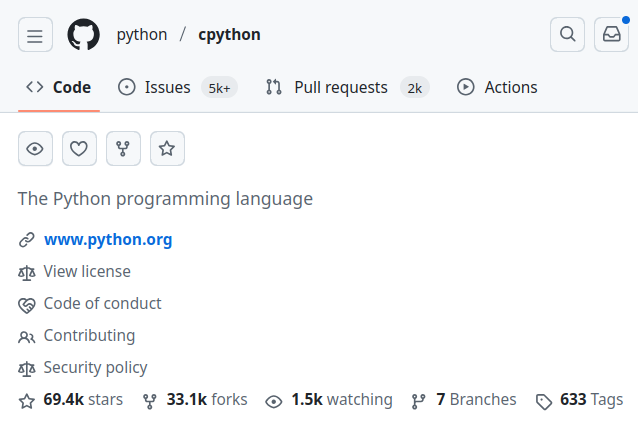

---
# try also 'default' to start simple
theme: apple-basic
# random image from a curated Unsplash collection by Anthony
# like them? see https://unsplash.com/collections/94734566/slidev
background: https://cover.sli.dev
# some information about your slides (markdown enabled)
title: Welcome to Slidev
info: |
  ## Slidev Starter Template
  Presentation slides for developers.

  Learn more at [Sli.dev](https://sli.dev)
# apply UnoCSS classes to the current slide
# https://sli.dev/features/drawing
drawings:
  persist: false
# slide transition: https://sli.dev/guide/animations.html#slide-transitions
transition: fade
# enable MDC Syntax: https://sli.dev/features/mdc
mdc: true
layout: intro-image-right
image: 'https://raw.githubusercontent.com/SofieTorch/pycones_slides/refs/heads/master/images/qr-slides.png'
---

# ¿Y si Python entendiera español?

Introducción práctica a modificar CPython

<div class="absolute bottom-10">
  <a href="sofietorch.github.io/pycones_slides">sofietorch.github.io/pycones_slides</a>
</div>

<!--
The last comment block of each slide will be treated as slide notes. It will be visible and editable in Presenter Mode along with the slide. [Read more in the docs](https://sli.dev/guide/syntax.html#notes)
-->

---
transition: fade
layout: intro-image-right
image: 'https://raw.githubusercontent.com/SofieTorch/pycones_slides/refs/heads/master/images/qr-slides.png'
---

# El plan de hoy

* Intro a CPython
* Compilar nuestro propio Python
* ¿Cómo funciona la grammar?
* Cambiar keywords y funciones a español
* Perderle el miedo a CPython :)

<div class="absolute bottom-10">
  <a href="sofietorch.github.io/pycones_slides">sofietorch.github.io/pycones_slides</a>
</div>

---
transition: fade
layout: intro-image-right
image: 'https://raw.githubusercontent.com/SofieTorch/pycones_slides/refs/heads/master/images/qr-slides.png'
---

# Antes de comenzar

* Instalar WSL (si están en Windows)
* Editor de texto listo
* Preparar el repo de CPython (<Link to="8">Ver slide 8</Link>)

<div class="absolute bottom-10">
  <a href="sofietorch.github.io/pycones_slides">sofietorch.github.io/pycones_slides</a>
</div>

---
transition: fade
layout: intro-image-right
image: 'https://raw.githubusercontent.com/SofieTorch/pycones_slides/refs/heads/master/images/sofi.jpeg'
---

# Sofi Toro 🇧🇴

* Software engineer @Synics 🇨🇭
* Former Google Developer Student Club Lead
* Former organizer @GDG Cochabamba, JS Bolivia & Hub Boliviano de IA
* Me gusta cantar, ir de hiking y charlar :) ⛰️
* Instagram: `__sofi__.py`

---
transition: fade
---

# ¿CPython?

<div class="mb-3"><i>¿No era Cython?</i></div>

* Runtime/entorno de ejecución de Python
* La implementación "oficial" de Python
* Cuando escribes `python` en la consola, CPython se ejecuta (si lo instalaste desde _python.org_)

<v-click>

</v-click>

---
transition: fade
layout: center
---

# ¿Cómo funciona?

* **🧩 Tokenizing:** Separa el código Python en piezas de instrucciones (tokens)
* <span v-mark.highlight.green="2"><b>🌳 Parsing:</b></span> Usa la gramática para construir un Abstract Syntax Tree (AST)
* **🔢 Compiling:** Convierte el AST a bytecode (archivos `.pyc` ocultos)
* **📀 Executing:** Interpreta y ejecuta el bytecode con la Python Virtual Machine (PVM)

<v-click>

>_Fun fact:_ el bytecode se guarda en caché para ser ejecutado, por lo que si corres una app Python dos veces sin cambiar el código, la segunda vez siempre será más rápida.

</v-click>

---
transition: fade
layout: center
---

# ¿Por qué en C?

<div class="mb-3"><i>(y no en Python)</i></div>

<v-clicks>

* Self-hosted compilers
* Source-to-source compilers
* Alternativas: PyPy, Jython, Cython
* El primer paso para crear un compilador es definir el lenguaje
  
</v-clicks>

---
transition: fade
layout: center
---

# Compilando CPython (3.9)

1. `$ git clone --branch 3.9 https://github.com/python/cpython`
2. `$ cd cpython`
3. `$ ./configure --with-pydebug`
4. `$ make -j2 -s`

<v-click>

🎉
```
$ ./python
Python 3.9.24+ (heads/3.9:9c4638d1b29, Oct 16 2025, 19:25:25) 
[GCC 13.3.0] on linux
Type "help", "copyright", "credits" or "license" for more information.
>>> 

```

</v-click>

---
transition: fade
---

# `cpython/`

<v-clicks>

|                           |                                           |
| ------------------------- | ----------------------------------------- |
| <kbd>Doc</kbd>            | Fuente de la documentación                |
| <kbd>Grammar</kbd>        | Definición del lenguaje                   |
| <kbd>Lib</kbd>            | Los módulos estándar escritos en Python   |
| <kbd>Modules</kbd>        | Los módulos estándar escritos en C        |
| <kbd>Objects</kbd>        | Object model y tipos core                 |
| <kbd>Parser</kbd>         | El parser de Python                       |
| <kbd>Python</kbd>         | El intérprete de CPython                  |

</v-clicks>

---
transition: fade
layout: center
---

# The grammar file

`Grammar/python.gram`

Define las reglas para la estructura del lenguaje

* `*` para repetir
* `+` para al menos una repetición
* `[]` para partes opcionales
* `|` para alternativas
* `()` para agrupar

---
transition: fade
layout: intro-image-right
---

# Definiendo un café


* Debe tener una taza
* Debe tener al menos un shot de espresso, pero puede tener varios shots
* Puede tener leche, pero es opcional
* Puede tener agua, pero es opcional
* Si tiene leche, la leche puede ser entera, descremada o de soya.

<v-click>

```
coffee: 'cup' ('espresso')+ ['water'] [milk]
milk: 'full-fat' | 'skimmed' | 'soy'
```

</v-click>

<v-click>


</v-click>

---
transition: fade
layout: two-cols
---

# `while`

Expresión + `:` + bloque de código:
```python
while finished == True:
  do_something()
```

<v-click>

Expresión de asignación (`named_expression` en el grammar):
```python
while letters := read(document,  10):
  print(letters)
```

</v-click>

<v-click>

Opcionalmente, puede seguirle `else` con un bloque de código:
```python
while item := next(iterable):
  print(item)
else:
  print("Iterable is empty")
```

</v-click>

::right::

<div class="mt-22"></div>

<v-click>

`python.grammar` > `while_stmt`:

```
while_stmt[stmt_ty]:
  | 'while' a=named_expression ':' b=block c=[else_bl...
```


</v-click>

<v-click>

<span v-mark.underline.green="4">
<code>try_stmt</code>, <code>if_stmt</code>
</span>

</v-click>

<style>
.two-columns {
  column-gap: 1.7em;
}
</style>


---
transition: fade
layout: center
---

# Regenerando la gramática

`python.gram` > `small_stmt`

````md magic-move [python.gram]
```txt [python.gram] {*|7}
small_stmt[stmt_ty] (memo):
| assignment
| e=star_expressions { _Py_Expr(e, EXTRA) }
| &'return' return_stmt
| &('import' | 'from') import_stmt
| &'raise' raise_stmt
| 'pass' { _Py_Pass(EXTRA) }
| &'del' del_stmt
| &'yield' yield_stmt
| &'assert' assert_stmt
| 'break' { _Py_Break(EXTRA) }
| 'continue' { _Py_Continue(EXTRA) }
| &'global' global_stmt
| &'nonlocal' nonlocal_stmt
```

```txt [python.gram] {7}
small_stmt[stmt_ty] (memo):
| assignment
| e=star_expressions { _Py_Expr(e, EXTRA) }
| &'return' return_stmt
| &('import' | 'from') import_stmt
| &'raise' raise_stmt
| ('pass' | 'pasar') { _Py_Pass(EXTRA) }
| &'del' del_stmt
| &'yield' yield_stmt
| &'assert' assert_stmt
| 'break' { _Py_Break(EXTRA) }
| 'continue' { _Py_Continue(EXTRA) }
| &'global' global_stmt
| &'nonlocal' nonlocal_stmt
```
````

---
transition: fade
layout: center
---

# Regenerando la gramática

<div class="mt-6"></div>

Regenerar el parser

```
$ make regen-pegen
```

Recompilar Python

```
$ ./configure --with-pydebug
$ make -j2 -s
```

---
transition: fade
layout: center
---

# Regenerando la gramática

<div class="mt-6"></div>

Corriendo Python

```bash
$ ./python
>>> def boo():
...    pasar
...
>>> boo()
>>>
```

---
transition: fade
layout: center
---

# "Referenced" statements

<div class="mt-6"></div>

````md magic-move [python.gram]
```txt [python.gram] {*|4,10}
small_stmt[stmt_ty] (memo):
| assignment
| e=star_expressions { _Py_Expr(e, EXTRA) }
| &'return' return_stmt
| &('import' | 'from') import_stmt

...

return_stmt[stmt_ty]:
| 'return' a=[star_expressions] { _Py_Return(a, EXTRA) }
```

```txt [python.gram] {4,10-11}
small_stmt[stmt_ty] (memo):
| assignment
| e=star_expressions { _Py_Expr(e, EXTRA) }
| &('return'|'retornar') return_stmt
| &('import' | 'from') import_stmt

...

return_stmt[stmt_ty]:
| 'return' a=[star_expressions] { _Py_Return(a, EXTRA) }
| 'retornar' a=[star_expressions] { _Py_Return(a, EXTRA) }
```
````

<v-click>

Recompilar (otra vez)
```bash
$ make regen-pegen
$ ./configure --with-pydebug
$ make -j2 -s
```

</v-click>

---
transition: fade
layout: center
---

# Cambiando Python a español >:)


<span class="mx-auto">

`if` => `si` | `else` => `sino` | `for` => `para` | `while` => `mientras` | `in` => `en` | `and` => `y`

</span>

---
transition: fade
layout: center
---

# Cambiando funciones

`bltinmodule.c` > `builtin_methods`

````md magic-move [bltinmodule.c]
```c [bltinmodule.c] {*|6}
static PyMethodDef builtin_methods[] = {
    {"__build_class__", (PyCFunction)(void(*)(void))builtin___build_class__,
     METH_FASTCALL | METH_KEYWORDS, build_class_doc},
    ...
    BUILTIN_POW_METHODDEF
    {"print",           (PyCFunction)(void(*)(void))builtin_print,      METH_FASTCALL | METH_KEYWORDS, print_doc},
    BUILTIN_REPR_METHODDEF
};
```


```c [bltinmodule.c] {6,7}
static PyMethodDef builtin_methods[] = {
  {"__build_class__", (PyCFunction)(void(*)(void))builtin___build_class__,
     METH_FASTCALL | METH_KEYWORDS, build_class_doc},
    ...
    BUILTIN_POW_METHODDEF
    {"print",           (PyCFunction)(void(*)(void))builtin_print,      METH_FASTCALL | METH_KEYWORDS, print_doc},
    {"imprimir",           (PyCFunction)(void(*)(void))builtin_print,      METH_FASTCALL | METH_KEYWORDS, print_doc},
    BUILTIN_REPR_METHODDEF
};
```
````

<div class="mt-8"></div>


---
transition: fade
layout: center
---

# Cambiando funciones

<div class="mt-4"></div>

Regeneramos los built-ins

```bash
$ make regen-all
```

<div class="mt-4"></div>
Y recompilamos ;)

<div class="mt-8"></div>

---
transition: fade
layout: center
---

# Cambiando funciones

`bltinmodule.c` > `SETBUILTIN`

````md magic-move [bltinmodule.c]
```c [bltinmodule.c] {*|7}
#define SETBUILTIN(NAME, OBJECT) \
    if (PyDict_SetItemString(dict, NAME, (PyObject *)OBJECT) < 0)       \
        return NULL;                                                    \
    ADD_TO_ALL(OBJECT)
    ...
    SETBUILTIN("map",                   &PyMap_Type);
    SETBUILTIN("range",                 &PyRange_Type);
    ...
    SETBUILTIN("set",                   &PySet_Type);
    debug = PyBool_FromLong(config->optimization_level == 0);
    if (PyDict_SetItemString(dict, "__debug__", debug) < 0) {
        Py_DECREF(debug);
        return NULL;
    }
    Py_DECREF(debug);

    return mod;
#undef ADD_TO_ALL
#undef SETBUILTIN
}
```


```c [bltinmodule.c] {7,8}
#define SETBUILTIN(NAME, OBJECT) \
    if (PyDict_SetItemString(dict, NAME, (PyObject *)OBJECT) < 0)       \
        return NULL;                                                    \
    ADD_TO_ALL(OBJECT)
    ...
    SETBUILTIN("map",                   &PyMap_Type);
    SETBUILTIN("range",                 &PyRange_Type);
    SETBUILTIN("rango",                 &PyRange_Type);
    ...
    SETBUILTIN("set",                   &PySet_Type);
    debug = PyBool_FromLong(config->optimization_level == 0);
    if (PyDict_SetItemString(dict, "__debug__", debug) < 0) {
        Py_DECREF(debug);
        return NULL;
    }
    Py_DECREF(debug);

    return mod;
#undef ADD_TO_ALL
#undef SETBUILTIN
}
```
````

<div class="mt-8"></div>

---
transition: fade
layout: center
---

# Cambiando funciones

`object.c` > `INIT_TYPE`

````md magic-move [object.c]
```c {*|10}
#define INIT_TYPE(TYPE, NAME) \
    do { \
        if (PyType_Ready(TYPE) < 0) { \
            return _PyStatus_ERR("Can't initialize " NAME " type"); \
        } \
    } while (0)
    INIT_TYPE(&PyBaseObject_Type, "object");
    ...
    INIT_TYPE(&PySuper_Type, "super");
    INIT_TYPE(&PyRange_Type, "range");
    ...    
    INIT_TYPE(&_PyInterpreterID_Type, "interpreter ID");
    return _PyStatus_OK();

#undef INIT_TYPE
}
```

```c {10,11}
#define INIT_TYPE(TYPE, NAME) \
    do { \
        if (PyType_Ready(TYPE) < 0) { \
            return _PyStatus_ERR("Can't initialize " NAME " type"); \
        } \
    } while (0)
    INIT_TYPE(&PyBaseObject_Type, "object");
    ...
    INIT_TYPE(&PySuper_Type, "super");
    INIT_TYPE(&PyRange_Type, "range");
    INIT_TYPE(&PyRange_Type, "rango");
    ...    
    INIT_TYPE(&_PyInterpreterID_Type, "interpreter ID");
    return _PyStatus_OK();

#undef INIT_TYPE
}
```
````

---
transition: fade
layout: center
---

# Let's code in espaÑol

<div class="h-4"></div>
```python
def factorial(n):
    resultado = 1
    para i en rango(1, n + 1):
        resultado *= i
    retornar resultado

para x en rango(1, 8):
    imprimir("Factorial de", x, "es", factorial(x))
```

<div class="h-4"></div>

```python
def fibonacci(limite):
    a, b = 0, 1
    mientras a < limite:
        imprimir(a, end=" ")
        a, b = b, a + b
    imprimir()

fibonacci(100)
```

---
transition: fade
layout: center
---

# Tokenizer

Crea un archivo `.py` con nuestro código en español.

Para ver que nuestras keywords son reconocidas usamos el módulo `tokenize`

```bash
$ ./python -m tokenize -e your_file.py
```

<div class="pt-12"></div>


---
transition: fade
layout: quote
---

# 🎉 ¡Felicidades! Creaste tu propia versión de Python, en español 🥳


---
transition: fade
layout: quote
---

# ¿Qué sigue?

<v-clicks>

* Libro: CPython Internals - Your guide to the Python3 interpreter, Anthony Shaw
* Charlas:
  * You don’t have to be a compiler engineer to work on Python — Savannah Bailey 
  * (Varios) - Cristián Maureira-Fredes
* Contribuye a CPython!

</v-clicks>

---
transition: fade
layout: section
---

# ¡Gracias! :)

[ig: \_\_sofi__.py](instagram.com/__sofi__.py)

[linkedin: /in/sofitoro](linkedin.com/in/sofitoro)